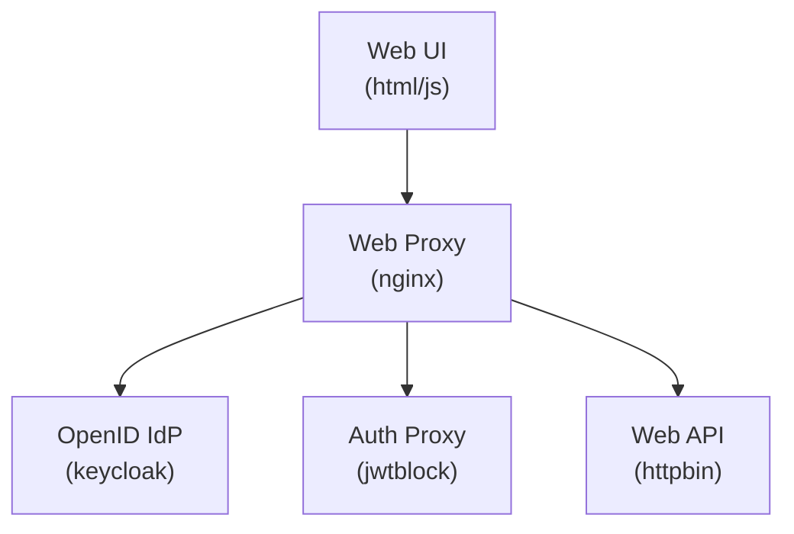

# Local Example Using Docker Compose

This example starts a series of Docker containers, including a demo UI app and an instance of JWT Block. An Nginx proxy accepts all incoming web connections for the `*.localhost` network. For calls to the protected API, `api.localhost`, Nginx will forward requests to JWT Block to check if the request token is both valid not blocked.


## Quick Start

Build the current code into a local Docker image, and serve the containers
using Docker Compose. Use `CTRL-C` to shut the container down.

```
make start
```

Stop and clear all of the containers.

```
make stop
```

When the containers are up, browse to [http://ui-app.localhost](http://ui-app.localhost). There are a few controls:
- **Login**: redirects to the IdP (Keycloak). Login with `alice`:`password`.
- **Call API**: sends a GET request to http://api.localhost/json, which
    requires authentication. If the UI app has a token, it will be used.
- **Logout**: call JWT block, blocking the token from making future
    authenticated calls.
- **Clear State**: clears the tokens from the UI app.

## Components

There are four small hosts and a proxy in this example.
1. `http://ui-app.localhost`
    - A static web UI loaded into the browser with demo controls.
    - This app has the OIDC login flow callback.
    - Logout will call the JWT Block service to add the access token to the blocklist.
1. `http://keycloak.localhost`
    - A Keycloak instance used as an OIDC identity provider.
    - The web app will redirect here for user login.
    - The demo user is `alice`:`password`.
1. `http://api.localhost`
    - A protected httpbin instance web service behind authentication.
    - This requires a valid access token that is not in the blocklist.
1. `http://jwtblock.localhost`
    - A JWT Block instance.
    - Nginx will defer to this service for authentication decisions (`auth_request` directive).
    - If the JWT is invalid or is in the blocklist then it returns HTTP 401.
    - This also has the "logout" endpoint, where an access token is added to the blocklist.

